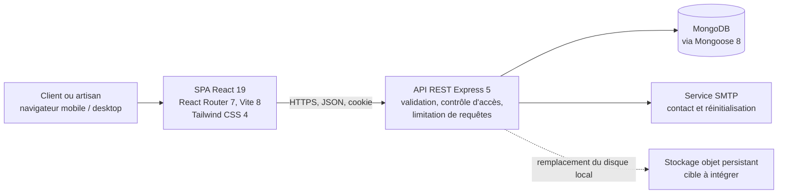

# ServiGo : conception d’une plateforme de découverte et de mise en relation avec les artisans en Côte d’Ivoire

**Rapport de projet — système web basé sur le cloud**  
**Version documentaire : 4 octobre 2026**  
**Périmètre évalué :** code source disponible dans le dépôt ServiGo.  
**Statut :** prototype fonctionnel en développement ; aucune URL publique de production n’est fournie ou vérifiable dans le dépôt.

## Résumé exécutif

ServiGo est une application web conçue pour aider des particuliers à découvrir des artisans de proximité et à évaluer leur offre avant de les contacter. Le problème ciblé est celui de la mise en relation : trouver un professionnel adapté, comprendre où il intervient, examiner ses travaux et distinguer les profils suffisamment documentés. Le projet se concentre initialement sur Abidjan et sur des métiers de service tels que la plomberie, l’électricité, la menuiserie, la peinture et la climatisation. Il ne prétend pas remplacer les réseaux de bouche-à-oreille, ni garantir la qualité d’une prestation, ni organiser la transaction complète.

Le produit réunit une interface React, une API Express, une base MongoDB et des services de courriel. L’interface inclut une vitrine, une recherche, des profils publics, des parcours de connexion et d’inscription, un espace client, un espace artisan et un back-office. L’API implémente entre autres les comptes à rôles, les favoris, les avis, les profils professionnels, les zones d’intervention, les galeries, les fonctions d’administration et le formulaire de contact. La documentation d’API générée par OpenAPI est exposée en développement.

Le rapport s’appuie sur l’état du code et sur des sources institutionnelles. Il distingue les faits de conception, les hypothèses à tester et les travaux restant à réaliser. Le dépôt ne prouve ni validation auprès d’utilisateurs, ni tests automatisés, ni déploiement public. Il ne contient pas de configuration CI. De plus, les fichiers envoyés sont enregistrés sur le disque du serveur, ce qui ne constitue pas un stockage durable lorsque l’hébergement est éphémère. Le plan de production recommande donc un hébergement cloud séparé pour le client, l’API, la base de données et les images, avant toute utilisation réelle.

## 1. Contexte et problème réel

Le besoin retenu est concret : les clients ont besoin d’identifier rapidement un artisan dont le métier et la zone d’intervention correspondent à leur demande, tandis que les artisans ont besoin d’une présence numérique qui rende leur savoir-faire visible. Le premier contact s’effectue souvent par des canaux relationnels ou téléphoniques. Ces canaux sont utiles, mais ils rendent difficile la comparaison structurée de profils lorsque le client ne dispose pas d’une recommandation préalable. Cette difficulté est ici une hypothèse de conception, et non le résultat d’une enquête locale menée par l’équipe.

Le contexte de travail informel importe pour la conception. L’OIT estimait en 2018 que 61,2 % de la population mondiale occupée se trouvait dans l’emploi informel. Cette donnée mondiale n’est pas une mesure des artisans ivoiriens ; elle incite néanmoins à concevoir une inscription et des profils accessibles, sans supposer une infrastructure administrative complexe.

L’accès au numérique mobile reste inégal. La GSMA indique qu’en Afrique, en 2025, près d’un milliard de personnes — 63 % de la population régionale — n’utilisaient pas l’internet mobile. Cette donnée ne décrit pas spécifiquement Abidjan ; elle motive une conception mobile-first, dont les performances restent à tester. Les indicateurs de la Banque mondiale sur l’internet et les abonnements mobiles en Côte d’Ivoire sont à analyser pour une étude nationale ; aucune valeur n’est extrapolée ici.

Le périmètre est volontairement limité à la découverte et à la prise de contact. La plateforme aide un client à parcourir des métiers, filtrer les profils, lire des avis et conserver des favoris. Elle aide un artisan à présenter ses services, ses zones, ses réalisations et sa disponibilité. Elle ne gère pas de devis, de réservation, d’assignation, de paiement, de litige, de garantie de travaux ou de fil de discussion. Cette distinction est importante : un profil « vérifié » ou une note affichée ne constitue pas une certification légale ni une garantie de résultat.

## 2. Revue de littérature et justification

L’OIT décrit une économie informelle vaste et hétérogène, représentant plus de 60 % de l’emploi mondial dans ses estimations 2018. Pour ServiGo, ce constat justifie des profils simples qui rendent compétences et zones visibles, sans exiger une gestion de facturation au stade du prototype. La plateforme ne doit toutefois pas suggérer un contrôle légal qui n’a pas eu lieu.

Les données GSMA distinguent couverture mobile et usage effectif. Elles appuient des objectifs UX — interface adaptative, pages légères, parcours courts — qui restent à vérifier par des mesures de poids et des essais sur réseau dégradé.

Global Findex, de la Banque mondiale, documente l’accès et l’usage des services financiers et des paiements numériques. Cette source ne prouve pas que les utilisateurs de ServiGo souhaitent payer en ligne. Aucun paiement n’est donc inclus ; son éventuelle intégration exige une recherche utilisateur, l’étude des obligations locales et des risques de fraude.

La synthèse conduit à trois exigences : recherche par métier et localisation, informations de confiance compréhensibles et accessibilité mobile. Des entretiens avec clients et artisans, l’observation de leurs pratiques et des tests de prototypes doivent confirmer ces hypothèses à Abidjan. Aucune recherche primaire n’a encore été menée.

## 3. Objectifs, utilisateurs et périmètre fonctionnel

Les utilisateurs principaux sont les clients qui cherchent un professionnel, les artisans qui souhaitent publier ou maintenir un profil, et les administrateurs chargés de gérer le catalogue et les contenus. Le parcours client commence par la vitrine ou la recherche, passe par une fiche artisan contenant les informations disponibles, puis se termine par une prise de contact hors transaction. Les comptes clients peuvent ajouter un profil aux favoris et publier un avis. Un compte artisan peut gérer sa page, sa galerie et ses zones d’intervention. L’administration comporte une gestion des services, communes, utilisateurs, artisans, avis et actions d’administration.

Les objectifs fonctionnels vérifiables dans le code sont : filtrer et paginer les profils ; consulter un profil via son slug ; contrôler les accès selon le rôle ; limiter les avis à un avis par client et artisan ; prendre en charge l’authentification par cookie et les courriels ; documenter l’API en environnement de développement. La validation des entrées est assurée par des validateurs Zod et des contraintes au niveau des modèles Mongoose, selon les routes.

Les objectifs non fonctionnels sont confidentialité, stabilité, utilisabilité mobile et évolutivité. Ils restent à vérifier : aucune mesure réelle de trafic, conversion, disponibilité ou satisfaction n’est disponible.

## 4. Architecture et choix technologiques

### Vue d’ensemble

La séparation client/API permet de déployer l’interface comme site statique et de faire évoluer le serveur indépendamment. Les manifestes déclarent React 19.2, React Router 7.18, Vite 8.2, Tailwind CSS 4.3, Motion 13.4, Express 5.1, Mongoose 8.9 et Zod 3.24 (plages de versions compatibles). Ces outils correspondent à l’interface composantée et à l’API Node déjà présentes dans le dépôt.

MongoDB est utilisé via Mongoose. Les profils, services, communes, utilisateurs, favoris, avis, zones, galeries, jetons de réinitialisation et actions d’administration ont des modèles dédiés. Le document convient aux attributs de profil variables ; des identifiants relient les entités. Schémas et index uniques encadrent les données et préviennent certains doublons. Atlas est une cible d’hébergement proposée, mais aucune instance ou URI de production n’est configurée.

Le client appelle l’API avec `fetch` et inclut les credentials. Les sessions utilisent un JWT dans un cookie `httpOnly`. L’API active Helmet, CORS configuré, des limites de requêtes et de corps JSON, et expose Swagger hors production. `/api/health` rapporte notamment l’état MongoDB.

### Modèle de données et contrats

Les collections structurent les entités métier sans imposer un modèle de transaction. `User` contient l’identité, le rôle et les informations de connexion. `ArtisanProfile` relie éventuellement un compte artisan à un profil public, au catalogue de services et aux données de présentation. `Review` référence profil et auteur. `Favorite` relie client et profil. `Zone` et `GalleryItem` documentent la couverture géographique et les réalisations. `Service` et `Commune` forment les référentiels administrables. `PasswordReset` gère l’expiration des jetons et `AdminAction` conserve les actions de gestion.

Les points d’entrée sont regroupés sous `/api/auth`, `/api/artisans`, `/api/services`, `/api/communes`, `/api/favorites`, `/api/reviews`, `/api/messages` et `/api/admin`. La recherche publique prend en charge le texte, le service, la commune, une note minimale, la disponibilité, l’ordre, la page et la limite. Les routes personnelles sont protégées par authentification et rôle. L’API constitue le contrat partagé entre interface et serveur ; avant d’ajouter de nouvelles fonctions, le contrat doit être maintenu avec les commentaires OpenAPI présents près des routes.

## 5. Expérience utilisateur, accessibilité et confiance

La vitrine présente catégories, artisans, avis, parcours, FAQ et actions de conversion. Les pages dédiées couvrent recherche, profils, contact, authentification, espaces client/artisan et administration, afin de faciliter la comparaison avant contact direct.

Les essais UX doivent vérifier sur mobile la recherche, la compréhension des avis et badges, et la mise à jour d’un profil artisan. L’audit d’accessibilité doit contrôler clavier, libellés, contrastes, alternatives textuelles et lecteurs d’écran : le responsive ne prouve pas la conformité WCAG.

La modération et les avis liés à un compte contribuent à la confiance, mais le badge `verified` ne prouve pas une vérification d’identité externe. Avant de l’afficher comme garantie, ServiGo doit publier critères, pièces contrôlées, conservation et recours.

## 6. Sécurité, vie privée et protection des données

Le dépôt utilise Helmet, validation des entrées, hachage de mots de passe via bcryptjs, cookies `httpOnly`/`sameSite=lax` sécurisés en production, limites de requêtes, contrôle de rôles et expiration des jetons de réinitialisation. Un changement de mot de passe révoque les anciennes sessions. Les téléversements sont limités à JPEG/PNG/WebP, 5 Mo et un nom aléatoire.

Ces mécanismes ne remplacent pas une revue de sécurité. Le secret JWT doit être fort et présent ; son absence provoque une erreur lors de l’authentification, pas un contrôle préalable au démarrage. Une URI MongoDB configurée mais inaccessible fait échouer le serveur en production, tandis qu’une URI absente active actuellement le mode dégradé et laisse le serveur démarrer. Il faut ajouter un contrôle de configuration obligatoire avant lancement. Limiter les origines CORS, privilèges réseau et droits de base ; exclure secrets et données personnelles inutiles des journaux. Définir finalités, rétention et suppression conformément aux obligations locales.

Un point d’architecture majeur concerne les cookies si le client et l’API sont hébergés sur des domaines différents. La configuration actuelle autorise une origine CORS unique et utilise `SameSite=Lax`. Une mise en production devrait privilégier des sous-domaines contrôlés par le projet et tester les cookies avec les navigateurs ciblés. Si l’hébergement impose des domaines réellement cross-site, la politique de cookie, la protection CSRF et les attributs `Secure` doivent être adaptés et testés explicitement ; il ne faut pas élargir CORS à toutes les origines.

Le risque opérationnel le plus visible est le stockage des images dans `server/uploads`. Ce stockage local n’est pas partagé entre instances et peut être perdu lors d’un redéploiement ou d’un changement de machine. Avant de publier le service, remplacer ce stockage par un service objet privé ou à accès contrôlé, définir une politique de taille et de type réelle côté contenu (pas uniquement sur le type MIME fourni par le client), mettre en place une analyse adaptée des fichiers, des sauvegardes et un processus de suppression. Les secrets doivent être injectés par le fournisseur cloud, jamais enregistrés dans Git.

## 7. Cloud, déploiement et exploitation

### État observé

Le dépôt comporte des scripts locaux de développement, de construction client, de lint client et de chargement de données. Il n’a pas de configuration de fournisseur cloud, de conteneur, d’infrastructure as code, de workflow GitHub Actions, de tests automatisés détectés ni d’adresse publique de déploiement. Le rapport ne peut donc déclarer l’application déployée ni accessible publiquement. Le script racine `npm run build` construit uniquement le client. L’API est démarrée séparément par `npm run dev:server` en développement et `npm start --workspace server` en mode serveur.

### Cible de déploiement proposée

Une cible possible est un client statique Vercel, une API Render, MongoDB Atlas et un stockage objet persistant pour les images. SMTP doit être configuré sur un domaine contrôlé. Cette architecture est une proposition, non un déploiement existant ; le choix final dépend des coûts, régions, sauvegardes et règles de transfert de données.

Le lancement exige base et utilisateur dédiés, injection des secrets (`MONGO_URI`, `JWT_SECRET`, `FRONT_URL`, SMTP), `VITE_API_URL`, domaine HTTPS, vérification de CORS et des cookies, migration vers le stockage objet, puis essais de santé, parcours, sauvegarde et restauration. Le seed doit rester limité à une base de démonstration.

La CI devrait exécuter installation reproductible, lint, tests et build avant une promotion contrôlée. Garder les secrets hors des logs. En production, surveiller disponibilité, latence, erreurs API, base, SMTP et stockage, avec procédures de sauvegarde, restauration et retour arrière.

## 8. Assurance qualité et évaluation

Le client expose des commandes de build et lint, mais aucune suite automatisée ni pipeline CI n’a été trouvé. Avant lancement, ajouter tests unitaires des validateurs, tests API sur base isolée et tests de parcours client/artisan.

Prioriser les parcours d’authentification et de session, contrôle des rôles, recherche, favori, avis, galerie, téléversement invalide, réinitialisation et modération. Les contrôles de sécurité doivent aussi examiner brute force, jetons expirés, accès horizontal, CSRF, types de fichiers et fuites d’erreurs.

Mesurer en test le temps de recherche, la réussite sans aide, la compréhension des badges et la mise à jour d’un profil. En pilote, suivre recherches infructueuses, clics de contact, retours artisans, latence p95, erreurs et disponibilité. Fixer les seuils à partir des observations et minimiser les données collectées.

## 9. Limites, risques et feuille de route

Les limites sont l’absence de recherche utilisateur, de déploiement public, de tests CI et de mesures d’accessibilité ou de performance, ainsi que le stockage local des images. Les profils et notes préchargés sont des exemples, non des évaluations de clients réels. Le service ne suit pas les demandes et ne résout pas les différends.

La feuille de route proposée est progressive :

1. **Recherche et validation :** entretiens contextualisés, tests des parcours client et artisan, définition d’une politique d’avis et de vérification, vérification des règles locales de données.
2. **Fondations de qualité :** tests API et interface, intégration continue, gestion d’erreurs cohérente, audit d’accessibilité, optimisation d’images et tests réseau mobile.
3. **Préproduction cloud :** domaine, TLS, base gérée, stockage objet, SMTP, variables secrètes, sauvegardes, métriques et test de restauration.
4. **Pilote limité :** petit groupe d’artisans et de clients, suivi des métriques, modération, retour d’usage, corrections avant croissance du catalogue.
5. **Évolution produit :** envisager demandes de devis, conversation ou paiement uniquement si la recherche confirme leur valeur et après analyse légale, opérationnelle et de fraude.

Cette séquence limite les risques : elle valide d’abord que le problème et les parcours sont réels, puis établit la résilience de l’infrastructure, et ne complexifie la transaction qu’après une preuve d’usage.

## Conclusion

ServiGo propose une réponse numérique cohérente à un problème de découverte et de mise en relation avec des artisans. Le code fournit déjà une base de produit au-delà d’une simple page d’accueil : interface multi-parcours, API documentée, comptes à rôles, profils, avis, favoris et administration. Le choix d’une architecture séparant le client, l’API et la base permet une évolution vers des services cloud gérés.

Le résultat doit toutefois être présenté comme un prototype en cours, et non comme un service déployé et prêt pour des clients. Les priorités avant la soumission finale sont la validation terrain, les tests automatisés et CI, le stockage persistant des images, la configuration et la vérification du déploiement HTTPS, puis l’ajout d’une URL publique vérifiée. Ce rapport explicite cette différence entre les capacités présentes et les objectifs de production afin que la décision d’évolution repose sur des preuves.

## Références

1. International Labour Organization. (2018). *Women and men in the informal economy: A statistical picture* (3e éd.). https://www.ilo.org/publications/women-and-men-informal-economy-statistical-picture-third-edition
2. GSMA. (2025). *The Mobile Economy Africa*. Données régionales sur la contribution économique du mobile et l’écart d’usage de l’internet mobile. https://www.gsma.com/solutions-and-impact/connectivity-for-good/mobile-economy/africa/
3. World Bank. (2025). *The Global Findex Database*. https://www.worldbank.org/en/publication/globalfindex
4. World Bank. *Individuals using the Internet (% of population) — Côte d’Ivoire (IT.NET.USER.ZS)*. Série d’indicateurs consultable par année. https://data.worldbank.org/indicator/IT.NET.USER.ZS?locations=CI
5. World Bank. *Mobile cellular subscriptions (per 100 people) — Côte d’Ivoire (IT.CEL.SETS.P2)*. Série d’indicateurs consultable par année. https://data.worldbank.org/indicator/IT.CEL.SETS.P2?locations=CI
6. MongoDB. *MongoDB Atlas documentation*. Description du service géré, des options de déploiement et des capacités opérationnelles. https://www.mongodb.com/docs/atlas/
7. Express.js. *Production Best Practices: Security*. Recommandations générales de sécurité pour une application Express en production. https://expressjs.com/en/advanced/best-practice-security/
8. ServiGo. Dépôt applicatif, notamment les manifestes `package.json`, les modèles dans `server/src/models/`, les routes dans `server/src/routes/` et le point d’entrée API `server/src/app.js`. État consulté le 4 octobre 2026.

**Note méthodologique :** les données OIT et GSMA sont citées à l’échelle indiquée par leurs sources (mondiale et régionale). Elles contextualisent le problème sans être extrapolées en estimations propres aux artisans d’Abidjan. Les choix d’architecture décrivent le code et des recommandations de déploiement ; les recommandations n’affirment pas qu’un fournisseur ou une URL publique est déjà configuré.
